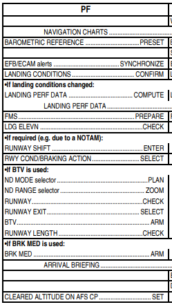

# CrewmateA350 — User Manual

**CrewmateA350** is a virtual First Officer companion for the **Airbus A350** in Microsoft Flight Simulator. It listens to your voice, responds with audio callouts, runs automated cockpit flows, and guides you through interactive checklists — just like a real crew member.

---

  

## Table of Contents

1. [Getting Started](#getting-started)
2. [Voice Commands](#voice-commands)
3. [Flows (Crewmate)](#flows-crewmate)
4. [Flows (user)](#flows-user)
5. [Checklists](#checklists)
6. [Tips & Troubleshooting](#tips--troubleshooting)

---

## Getting Started

### Requirements

- The EN‑US voice package must be installed to use the voice engine.
- To use the trainer app, set your Display Language to EN‑US while training (you can change it back afterward).

### Voice Modes

CrewmateA350 supports two voice recognition modes:

| Mode                   | How it works                                         |
| ---------------------- | ---------------------------------------------------- |
| **Continuous**         | The microphone is always listening. Speak naturally. |
| **Push-to-Talk (PTT)** | Not implemented yet.                                 |

### Volume & Voice Sensitivity

- **Sound Volume** — Controls how loud the FO's audio callouts are (0–100).
- **Mic Gain** — Adjusts microphone sensitivity. Increase this if the FO isn't picking up your voice reliably.

---

## Voice Commands

Speak these phrases clearly during your flight. The FO uses partial matching — you don't need to be word-perfect, but aim to include the key phrase.

### Gear

| Say           | What happens                                                      |
| ------------- | ----------------------------------------------------------------- |
| `"gear down"` | Lowers the landing gear. **Speed must be at or below 255 knots.** |
| `"gear up"`   | Raises the landing gear.                                          |

### Flaps

The FO will confirm the speed is checked before moving the flaps while airborne.

| Say             | Flap Setting        | Max Speed                                |
| --------------- | ------------------- | ---------------------------------------- |
| `"flaps zero"`  | Flaps 0 (retracted) | —                                        |
| `"flaps one"`   | Flaps 1             | 255 kts (A350-900) / 260 kts (A350-1000) |
| `"flaps two"`   | Flaps 2             | 212 kts / 219 kts                        |
| `"flaps three"` | Flaps 3             | 195 kts / 206 kts                        |
| `"flaps full"`  | Flaps Full          | 186 kts / 192 kts                        |

### Engine Anti-Ice

| Say                     | What happens                               |
| ----------------------- | ------------------------------------------ |
| `"Engine anti ice on"`  | Turns on engine anti-ice for both engines. |
| `"Engine anti ice off"` | Turns off engine anti-ice.                 |

### Wing Anti-Ice

| Say                   | What happens             |
| --------------------- | ------------------------ |
| `"Wing anti ice on"`  | Turns on wing anti-ice.  |
| `"Wing anti ice off"` | Turns off wing anti-ice. |

### Landing Lights

| Say                    | What happens              |
| ---------------------- | ------------------------- |
| `"Landing lights on"`  | Turns on landing lights.  |
| `"Landing lights off"` | Turns off landing lights. |

### Nose Wheel Lights

| Say                  | What happens                 |
| -------------------- | ---------------------------- |
| `"Takeoff light on"` | Turns on nose takeoff light. |
| `"Taxi lights on"`   | Turns on nose taxi light.    |
| `"Taxi lights off"`  | Turns off nose taxi light.   |

### Strobe Lights

| Say                    | What happens       |
| ---------------------- | ------------------ |
| `"Strobe lights on"`   | Turns on strobes.  |
| `"Strobe lights auto"` | Sets strobes auto. |
| `"Strobe lights off"`  | Turns off strobes. |

### Flight Director

| Say                             | What happens                                               |
| ------------------------------- | ---------------------------------------------------------- |
| `"Flight Director on"`          | Activates the Flight Director.                             |
| `"Flight Director off"`         | Deactivates the Flight Director.                           |
| `"Flight Director off bird on"` | Deactivates the Flight Director and selects TRK/FPA on AP. |
| `"Bird on"`                     | Selects TRK/FPA on AP.                                     |
| `"Bird off"`                    | Deselects TRK/FPA on AP.                                   |

### Autopilot

| Say                                                                                                 | What happens                                                                  |
| --------------------------------------------------------------------------------------------------- | ----------------------------------------------------------------------------- |
| `"Autopilot on"` or `"Auto Pilot on"`                                                               | Engages Autopilot 1.                                                          |
| `"Set speed ___ or speed select ___"`                                                               | Sets commanded speed.                                                         |
| `"Set heading ___ or heading select ____"`                                                          | Sets commanded heading.                                                       |
| `" Set altitude _____ or altitude select _____ or set flight level ___ or flight level select ___"` | Sets commanded altitude                                                       |
| `"Pull speed"`                                                                                      | Pulls speed knob to select selected speed.                                    |
| `"Pull speed ___"`                                                                                  | Pulls speed knob to select selected speed and sets the commanded speed.       |
| `"Manage speed"`                                                                                    | Pushes speed knob to select managed speed                                     |
| `"Pull heading"`                                                                                    | Pulls heading knob to select selected heading.                                |
| `"Pull heading ___"`                                                                                | Pulls heading knob to select selected heading and sets the commanded heading. |
| `"Manage nav"`                                                                                      | Pushes heading knob to select LNAV.                                           |
| `" Altitude _____ pull or Flight level ___ pull"`                                                   | Sets commanded altitude and pulls altitude knob.                              |
| `" Altitude _____ manage or Flight level ___ manage"`                                               | Sets commanded altitude and pushes altitude knob.                             |
| `" Altitude pull or Flight level pull"`                                                             | Pulls altitude knob.                                                          |
| `" Altitude manage or Flight level manage"`                                                         | Pushes altitude knob.                                                         |

### Flight Controls Check

| Say                       | What happens                                                                      |
| ------------------------- | --------------------------------------------------------------------------------- |
| `"Flight controls check"` | Starts the Flight controls flow: Up, Down, Left, Right, Rudder Left, Rudder Right |

### Preflight Timer

| Say                            | What happens                                                             |
| ------------------------------ | ------------------------------------------------------------------------ |
| `"Let's prepare the aircraft"` | Starts the preflight countdown timer to help you track preparation time. |

### Launching Flows by Voice

| Say                                                                                 | Flow launched       |
| ----------------------------------------------------------------------------------- | ------------------- |
| `"Before start procedure"` or `"Before start flow"`                                 | Before Start flow   |
| `"Clear left"` or `"Left side clear"`                                               | Clear Left flow     |
| `"Runway entry procedure"` or `"Clear to line up"` or `"Before takeoff procedure"` | Before Takeoff flow |

### Launching Checklists by Voice

| Say                                                               | Checklist launched          |
| ----------------------------------------------------------------- | --------------------------- |
| `"Cockpit preparation checklist"`                                 | Cockpit Preparation         |
| `"Before start checklist"`                                        | Before Start                |
| `"After start checklist"`                                         | After Start                 |
| `"Taxi checklist"`                                                | Taxi                        |
| `"Lineup checklist"` or `"Line up checklist"`                     | Line Up                     |
| `"Approach checklist"`                                            | Approach                    |
| `"Landing checklist"`                                             | Landing                     |
| `"Parking checklist"`                                             | Parking                     |
| `"Secure aircraft checklist"`                                     | Secure Aircraft             |
| `"Departure change checklist"`                                    | Departure Change Checklist  |
| `"Stop checklist"` or `"Abort checklist"` or `"Cancel checklist"` | Aborts the active checklist |

---

## Flows (Crewmate)

Flows are automated sequences where the FO sets cockpit controls on your behalf. You can trigger them by voice (see above) or from the **Flows panel** in the app. The FO will announce the start/end of flows that have significant phases.

Flows are listed in approximate flight-phase order:

---

### Preliminary Cockpit Preparation

**When:** Cold and dark, before anything else.

The FO powers up the aircraft — activating batteries, connecting external power, runs the fire test, sets IRS and configures his RMP. Shortly after he does the walkaround

---

### Cockpit Preparation (CM2 side)

**When:** After walkaround.

The FO performs the oxygen test procedure on the FO side.

---

### Before Start

**When:** Just before requesting pushback or engine start. 

FO locks cockpit door and sets DEFAULT SETTINGS in MFD SURV.

---

### After Start

**When:** After both engines are running and ignition knob set to NORM.

The FO arms the ground spoilers, resets rudder trim and sets the correct flap setting for takeoff. Do note when icing conditions present (set in takeoff window), flaps will be left up, remember to command flap setting when near holding point of runway.

---

## Tutorial

### Assumptions

This tutorial assumes you are parked at the gate with engines off. You are the Captain and PF (Pilot Flying); CrewMate acts as PM (Pilot Monitoring).

### Typical preflight timeline (example)

- 60 min: Cockpit door and curtains opened.
- 58 min: PM takes their seat.
- 55 min: PM starts preliminary cockpit preparation.
- 40 min: PM departs for external walkaround.
- 30 min: PM returns and continues cockpit preparation.
- 25 min: PF conducts the departure briefing (enter takeoff data in the Takeoff Performance window).
- 20 min: PF calls for the COCKPIT PREPARATION flow.
- 1 min: CrewMate closes the cockpit door. PF calls for the BEFORE START checklist.

### Pushback and Engine Start

- Announce each engine start (e.g., “Starting engine one”).
- When ignition is set to NORMAL, PM will start the AFTER START flow pattern. If anti‑ice will be used, flaps may be left as required.
- On hand signal from ground personnel, call for the AFTER START checklist.

### Taxi

- PM announces when the cabin is ready.
- Check flight controls at a convenient time before or during taxi (this is done before arming the autobrake).
- Control check sequence: Full Up, Full Down, Full Left, Full Right, Rudder Full Left, Rudder Full Right.
- After the controls check, PM performs the TAXI flow pattern.
- After T.O. CONFIG pushbutton is pressed and a cabin report is received, PF calls for the TAXI checklist.

### Line‑up & Takeoff

- PF calls for the Line‑up flow.
- When line‑up clearance is received and the Line‑up flow pattern is complete, PF calls for the LINE‑UP checklist.
- When cleared for takeoff, announce “TAKEOFF.”

### Acceleration

- The After‑Takeoff flow is triggered when flaps are retracted to zero.

### Climb to 10,000 ft

### Descent Preparation

- PF should insert landing data in the Landing Performance window.

### 10k Descent

### Approach

- After passing the transition level or setting the barometric reference, complete the APPROACH checklist.

### Landing

- When LDG CONF is set and a cabin report is received, call for the LANDING checklist.
- PF announces “Continue” at minima or “Go‑around - flaps” as appropriate.

### After Landing

**When:** When you disarm spoilers.

The FO retracts the flaps, starts the APU, configures anti ice, and turns off WXR/TERR.

---

### Shutdown

**When:** Engines off, parked at gate.

The FO turns off all fuel pumps and anti ice systems.

---

## Flows (user)

In this addon, you stil need to do some flows by yourself.

Flows are listed in tables:

| Preliminary Cockpit Preparation                           |
|-----------------------------------------------------------|
| `Set interior lights`                                     |
| `Initialize FMS (callsign/and flight plan) and check ANF` |
| `Preliminary performance calculation`                     |

| Cockpit Preparation (CM2 outside) |
|-----------------------------------|
| `Set all white buttons off`       |
| `CAPT&PURS switch set`            |
| `RCDR GND CTL on`                 |
| `Set exterior lights`             |
| `Set signs`                       |
| `Set air panel`                   |
| `Test CVR`                        |
| `Check RMP`                       |
| `Check parking brake`             |
| `Set EFIS options`                |
| `Set AFS/FCU`                     |
| `Test OXY mask`                   |
| `Departure briefing`              |

> When both done, do the Cockpit preparation checklist

| Before Start                   |
|--------------------------------|
| `Performance calculation`      |
| `Deploy HUD`                   |
| `Beacon light on`              |
| `Select SURV DEFAULT SETTINGS` |

> When both done, do the Before start checklist

| After Start                |
|----------------------------|
| `Engine start NORM`        |
| `APU BLEED off`            |
| `Set anti ice as required` |
| `APU off if not required`  |

> When both done, do the After start checklist

| Taxi                    |
|-------------------------|
| `Set ND to ZOOM`        |
| `Set exterior lights`   |
| `Brake check`           |
| `Flight controls check` |
| `Set FMS PERF page`     |

> When both done, but before reaching runway holding point, do the Taxi checklist

| Before takeoff                            |
|-------------------------------------------|
| `Check if approach path clear of traffic` |
| `Set exterior lights`                     |
| `Set EFIS`                                |

> When both done, do the Line up checklist

| Takeoff procedure                        |
|------------------------------------------|
| `Set exterior lights`                    |
| `Announce "Takeoff"`                     |
| `Set 25% THR then FLX/TOGA`              |
| `Order "gear up" after "positive climb"` |
| `Clean up flaps after ACCEL ALT reached` |

> For climb through 10,000/FL100, it's automatic.

> Cruise you just check SD pages and step climb/descend the aircraft.

Descent preparation:

| Descent below 10,000/FL100             |
|----------------------------------------|
| `LS button on if doing a xLS approach` |

> When below TL, do the Approach checklist

| Aircraft config for landing                                     |
|-----------------------------------------------------------------|
| `Extend flaps and gear on schedule (1->2->L/G DOWN->3(->FULL))` |
| `If shooting an ILS, AP1+2 on`                                  |

> When fully configured, do the Landing checklist

| Rollout and after landing                                  |
|------------------------------------------------------------|
| `70 kt reverser idle, at taxi speed stow`                  |
| `Disengage autobrake when convenient`                      |
| `Clear of runway, disarm spoilers and set exterior lights` |
| `Set ND to ZOOM`                                           |

| Parking                                                           |
|-------------------------------------------------------------------|
| `Set parking brakes, check power source, then shut down engines`  |
| `Beacon and wing lights off, set other exterior lights as needed` |
| `Disarm slides and belts sign off`                                |
| `Stow HUD `                                                       |

> When both done, do the Parking Checklist

| Go Around                                                           |
|---------------------------------------------------------------------|
| `Set TOGA then MCT, rotate aircraft and announce "go around flaps"` |
| `Order "gear up" after "positive climb"`                            |
| `Follow after takeoff procedure after go around`                    |

---

## Checklists

Checklists are interactive — the FO will read each challenge aloud and wait for your verbal response. Speak clearly and the FO will confirm each item before moving to the next.

If your response doesn't match what's expected, the FO may repeat the challenge or play an "are you sure?" callout. Simply respond correctly to continue.

To abort a checklist at any time, say **`"Stop checklist"`**.

---

### Cockpit Preparation

Start by saying: **`"Cockpit preparation checklist"`**

| FO Challenge         | Say                                                                 |
| -------------------- | ------------------------------------------------------------------- |
| Gear pins and covers | `"Removed"`                                                         |
| Fuel quantity        | `"Set and checked"`                                                 |
| Barometric reference | `"Set and checked"` or your QNH setting (e.g. `"1013"` or `"2992"`) |

### Securing the Aircraft

- After the last passenger leaves (if securing the aircraft), call for the SECURE AIRCRAFT checklist.

### Parking

- Turn off taxi lights when turning into the gate, or ask the PM to confirm.
- Shutting down the engines will trigger the Parking flow.

---

## Voice Commands

Speak these phrases clearly during flight. The FO uses partial matching — you don't need to be word‑perfect, but include the key phrase.

### Preflight Timer

| Say                          | What happens                                                             |
| ---------------------------- | ------------------------------------------------------------------------ |
| "Let's prepare the aircraft" | Starts the preflight countdown timer to help you track preparation time. |

### Gear

| Say         | What happens                                                      |
| ----------- | ----------------------------------------------------------------- |
| "gear down" | Lowers the landing gear. **Speed must be at or below 255 knots.** |
| "gear up"   | Raises the landing gear.                                          |

### Flaps

The FO will confirm speed limits before moving flaps while airborne.

| Say           | Flap Setting        | Max Speed                                |
| ------------- | ------------------- | ---------------------------------------- |
| "flaps zero"  | Flaps 0 (retracted) | —                                        |
| "flaps one"   | Flaps 1             | 255 kts (A350‑900) / 260 kts (A350‑1000) |
| "flaps two"   | Flaps 2             | 212 kts / 219 kts                        |
| "flaps three" | Flaps 3             | 195 kts / 206 kts                        |
| "flaps full"  | Flaps Full          | 186 kts / 192 kts                        |

### Engine Anti‑Ice

| Say                   | What happens                               |
| --------------------- | ------------------------------------------ |
| "Engine anti ice on"  | Turns on engine anti‑ice for both engines. |
| "Engine anti ice off" | Turns off engine anti‑ice.                 |

### Wing Anti‑Ice

| Say                 | What happens             |
| ------------------- | ------------------------ |
| "Wing anti ice on"  | Turns on wing anti‑ice.  |
| "Wing anti ice off" | Turns off wing anti‑ice. |

### Lights (Landing / Taxi / Nose / Strobe)

| Say                  | What happens                 |
| -------------------- | ---------------------------- |
| "Landing lights on"  | Turns on landing lights.     |
| "Landing lights off" | Turns off landing lights.    |
| "Taxi lights on"     | Turns on nose taxi light.    |
| "Taxi lights off"    | Turns off nose taxi light.   |
| "Takeoff light on"   | Turns on nose takeoff light. |
| "Strobe lights on"   | Turns on strobes.            |
| "Strobe lights auto" | Sets strobes to AUTO.        |
| "Strobe lights off"  | Turns off strobes.           |

### Flight Director

| Say                           | What happens                                         |
| ----------------------------- | ---------------------------------------------------- |
| "Flight Director on"          | Activates the Flight Director.                       |
| "Flight Director off"         | Deactivates the Flight Director.                     |
| "Flight Director off bird on" | Deactivates FD and selects TRK/FPA on the autopilot. |
| "Bird on"                     | Selects TRK/FPA on the autopilot.                    |
| "Bird off"                    | Deselects TRK/FPA on the autopilot.                  |

### Autopilot

| Say                                                                                                | What happens                                       |
| -------------------------------------------------------------------------------------------------- | -------------------------------------------------- |
| "Autopilot on"                                                                                     | Engages Autopilot 1.                               |
| "Set speed **_ or speed select _**"                                                                | Sets commanded speed.                              |
| "Set heading **\_ or heading select \_\_**"                                                        | Sets commanded heading.                            |
| "Set altitude **\_** or altitude select **\_** or set flight level **_ or flight level select _**" | Sets commanded altitude.                           |
| "Pull speed"                                                                                       | Pulls speed knob to select selected speed.         |
| "Pull speed \_\_\_"                                                                                | Pulls speed knob and sets the commanded speed.     |
| "Manage speed"                                                                                     | Pushes speed knob to select managed speed.         |
| "Pull heading"                                                                                     | Pulls heading knob to select selected heading.     |
| "Pull heading \_\_\_"                                                                              | Pulls heading knob and sets the commanded heading. |
| "Manage nav"                                                                                       | Pushes heading knob to select LNAV.                |
| "Altitude **\_** pull or Flight level \_\_\_ pull"                                                 | Sets commanded altitude and pulls altitude knob.   |
| "Altitude **\_** manage or Flight level \_\_\_ manage"                                             | Sets commanded altitude and pushes altitude knob.  |
| "Altitude pull or Flight level pull"                                                               | Pulls altitude knob.                               |
| "Altitude manage or Flight level manage"                                                           | Pushes altitude knob.                              |

### Flight Controls Check

| Say                     | What happens                                                                      |
| ----------------------- | --------------------------------------------------------------------------------- |
| "Flight controls check" | Starts the flight controls flow: Up, Down, Left, Right, Rudder Left, Rudder Right |

### Launching Flows by Voice

| Say                                            | Flow launched       |
| ---------------------------------------------- | ------------------- |
| "Clear left" or "Left side clear"              | Clear Left flow     |
| "Runway entry procedure" or "Clear to line up" | Before Takeoff flow |

### Launching Checklists by Voice

| Say                                                         | Checklist launched          |
| ----------------------------------------------------------- | --------------------------- |
| "Cockpit preparation checklist"                             | Cockpit Preparation         |
| "Before start checklist"                                    | Before Start                |
| "After start checklist"                                     | After Start                 |
| "Taxi checklist"                                            | Taxi                        |
| "Lineup checklist"                                          | Line Up                     |
| "Approach checklist"                                        | Approach                    |
| "Landing checklist"                                         | Landing                     |
| "Parking checklist"                                         | Parking                     |
| "Secure aircraft checklist"                                 | Secure Aircraft             |
| "Departure change checklist"                                | Departure Change Checklist  |
| "Stop checklist" or "Abort checklist" or "Cancel checklist" | Aborts the active checklist |

---

## Tips & Troubleshooting

**The FO isn't hearing me**

- Check that your microphone is selected and working.
- Adjust the **Voice Sensitivity** setting.

**The FO keeps repeating the challenge**

- Your response didn't match the expected phrase. Listen to the challenge and use one of the phrases listed in this manual (voice matching can be tuned in settings).
- If a physical switch must be set first (e.g., parking brake), set it in the cockpit before responding.

**How do I stop a checklist mid‑way?**

- Say **"Stop checklist"**, **"Abort checklist"**, or **"Cancel checklist"** at any time.

**Can I run flows and checklists manually without voice?**

- Yes. Both can be triggered from the **Flows** and **Checklist** panels in the app UI.

---
